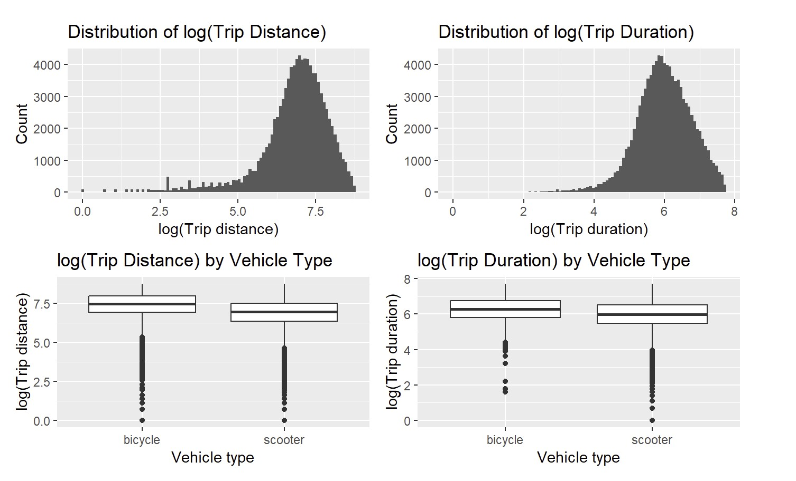

# Trip Distance and Duration Patterns in Austin’s Shared Micromobility System

## Overview
This project analyzes trip distance and duration patterns in Austin’s shared micromobility system
(e-scooters and bikes) using 2019 public data. The goal is to understand how usage patterns differ
by vehicle type, time, and location through exploratory data analysis and regression modeling.

## Research Question
How do trip distance and duration differ between scooters and bikes, after accounting for temporal
and spatial factors such as time of day, day of week, and city council districts?

## Data
- **Source:** Austin Open Data Portal – Shared Micromobility Trips
- **Time period:** January–December 2019
- **Observations:** ~1 million trips (after filtering)
- **Key variables:**
  - Trip distance
  - Trip duration
  - Vehicle type (scooter vs. bike)
  - Time of day, day of week
  - City council district




## Methodology
- Cleaned and filtered raw trip-level data to remove implausible values and ensure consistency.
- Conducted exploratory data analysis (EDA) to examine distributions and relationships among key variables.
- Applied log-linear regression models to account for skewness in distance and duration.
- Controlled for temporal and spatial factors to isolate differences by vehicle type.
- Selected models using Bayesian Information Criterion (BIC) to balance fit and complexity.
- Performed robustness checks including alternative transformations and heteroskedasticity-aware methods.

## Key Results
- Scooter trips are generally shorter in distance and duration than bike trips.
- Differences persist after controlling for time and location effects.
- Results are descriptive and observational; no causal claims are made.


## How to Reproduce

1. Download the Austin Shared Micromobility dataset from the Austin Open Data Portal.
2. Run the R scripts in the following order:
   - `code/01_data_cleaning.R`
   - `code/02_eda.R`
   - `code/03_regression_models.R`
3. Generated figures and tables will be saved to the `figures/` directory.


## Reproducibility
All analysis was conducted in R.
- Data preprocessing, analysis, and visualization scripts are provided in this repository.
- Results can be reproduced by running the scripts in the specified order (see Repository Structure).

## Repository Structure
```
├── data/ # Raw and processed datasets (or instructions to obtain them)
├── code/ # R scripts for data cleaning and modeling
├── figures/ # Generated plots
├── report/ # Final report (PDF)
├── appendix/ # EDA and diagnostic checks
└── README.md
```

## Notes
- This analysis focuses on descriptive patterns and associations.
- Robustness checks and diagnostic results are included in the appendix to maintain clarity
  in the main analysis.

## Author
**Donghyun Kim**  
University of Michigan  
STATS 500 – Applied Statistics
